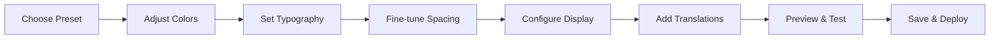

# Customizer Overview

The visual customizer is your control center for styling the sticky cart. Three-panel layout with instant preview.

## Access

1. Shopify Admin → **Apps** → **Sticky Add to Cart**
2. Click **Open Customizer**

## Interface Layout

### Left Panel - Controls

**7 Tabs for customization:**

| Tab | Controls |
|-----|----------|
| **Presets** | 25+ ready-made themes |
| **General** | Display type, visibility, buy now |
| **Colors** | Buttons, badges, text |
| **Typography** | Fonts, sizes, weights |
| **Spacing** | Radius, padding, gaps |
| **Effects** | Button animations (8 effects) |
| **Languages** | Translations, custom text |

### Center Panel - Live Preview

Real-time preview of your changes:

- ⚡ **Instant updates** - No refresh needed
- 📱 **Device toggle** - Switch mobile/desktop view
- 🎯 **Interactive** - Click to test functionality
- ✅ **Realistic** - Actual product display

### Right Panel - Code Export

For developers and backups:

- Export configuration JSON
- Manual integration code
- Settings backup
- Share between stores

## Workflow



### Step-by-Step

1. **Presets** - Apply theme close to your brand
2. **Colors** - Match brand colors
3. **Typography** - Set fonts and sizes
4. **Spacing** - Adjust padding and radius
5. **General** - Display options
6. **Effects** - Add button animations
7. **Languages** - Customize text
8. **Preview** - Test mobile + desktop
9. **Deploy** - Go live

## Key Features

### Real-Time Preview

Changes apply **instantly**:
- Color adjustments
- Font changes
- Spacing tweaks
- Toggle settings

No save/refresh needed during editing.

### Device Preview Toggle

Test both platforms:
- **Mobile** - Touch-friendly, vertical layout
- **Desktop** - Mouse hover, horizontal layout

Click device icon to switch views.

### Smart Defaults

Every setting has sensible defaults:
- Works immediately after install
- Optimized for conversions
- Mobile-first approach

## Common Tasks

### Change Button Color

```
Colors tab → Primary Button BG → Select color
```

### Make Buttons Rounder

```
Spacing tab → Border Radius → Increase slider
```

### Add Buy Now Button

```
General tab → Show Buy Now Button → Toggle ON
```

### Apply Preset Theme

```
Presets tab → Choose theme → Click Apply
```

### Translate Text

```
Languages tab → Select language → Enter translations
```

## Best Practices

:::tip Customization Tips
1. **Start with preset** - Don't build from scratch
2. **Preview both views** - Mobile AND desktop
3. **Save frequently** - Protect your work
4. **Test interactions** - Click buttons in preview
5. **Keep it simple** - Don't over-customize
:::

## Keyboard Shortcuts

| Key | Action |
|-----|--------|
| **Tab** | Navigate fields |
| **Enter** | Apply changes |
| **Esc** | Close color picker |
| **↑↓** | Adjust sliders |

## Troubleshooting

**Preview not updating?**
- Hard refresh (Cmd+Shift+R / Ctrl+Shift+R)
- Clear browser cache
- Try different browser

**Can't see changes on store?**
- Click Save, then Deploy
- Wait 1-2 minutes
- Clear store cache

## Next Steps

Master each customization area:

- **[Presets](./presets)** - Quick theme application
- **[General](./general-settings)** - Display options
- **[Colors](./colors)** - Brand colors
- **[Typography](./typography)** - Fonts
- **[Spacing](./spacing)** - Layout

## Accessing the Customizer

1. From your Shopify admin, go to **Apps**
2. Click **Sticky Add to Cart**
3. Click **Open Customizer** button

The customizer loads with a three-panel layout optimized for real-time editing.

## Interface Layout

### Left Panel - Control Tabs

This is where you make all your customization changes. The panel contains several tabs:

#### Presets Tab
- Quick-apply professionally designed themes
- 5 pre-built color and style combinations
- One-click application
- Great starting point for customization

#### General Tab
- Display type (collapsed vs expanded)
- Desktop visibility toggle
- Buy now button enable/disable
- Core functionality settings

#### Colors Tab
- Button colors (primary and secondary)
- Hover states
- Sale price highlighting
- Discount badge styling
- All color customization in one place

#### Typography Tab
- Font family selection
- Font sizes (product name, price, buttons)
- Font weights (light to bold)
- Complete text styling control

#### Spacing Tab
- Border radius (corner roundness)
- Padding settings
- Element gaps
- Layout fine-tuning

#### Languages Tab
- Button text customization
- Label translations
- Multi-language support
- Custom messaging

### Center Panel - Live Preview

The preview panel shows your changes in real-time:

**Features:**
- Interactive product preview
- Real-time updates (changes apply instantly)
- Mobile/desktop view toggle
- Functional buttons (you can click and interact)

**How to Use:**
1. Make changes in the left panel
2. Watch the preview update automatically
3. Click the mobile/desktop toggle icon to switch views
4. Interact with the sticky cart to test functionality

**Preview Tips:**
- Test both mobile and desktop views
- Try clicking variant options
- Test the "Add to Cart" button
- Scroll the preview page to see sticky behavior

### Right Panel - Code Export

For advanced users and developers:

**Purpose:**
- Shows generated configuration code
- Copy for manual implementation
- Export settings for backup
- Share configurations between stores

**When to Use:**
- Backing up your settings
- Sharing configuration with developers
- Manual theme integration
- Troubleshooting issues

## Customization Workflow

### Recommended Approach

**Step 1: Choose a Starting Point**
- Apply a preset theme that's close to your brand
- Or start from scratch with default settings

**Step 2: Adjust Colors**
- Set primary button to your brand color
- Configure hover states
- Customize sale price highlights

**Step 3: Set Typography**
- Choose a font that matches your store
- Adjust sizes for readability
- Set appropriate weights

**Step 4: Fine-Tune Spacing**
- Adjust border radius for desired look
- Set padding for comfortable spacing
- Configure gaps between elements

**Step 5: Configure Display Options**
- Choose collapsed or expanded display
- Enable/disable desktop visibility
- Add buy now button if needed

**Step 6: Add Translations** (if needed)
- Customize button text
- Add language-specific labels
- Configure multi-language support

**Step 7: Preview and Test**
- Check mobile view
- Check desktop view
- Test all interactive elements
- Verify colors and spacing

**Step 8: Save and Deploy**
- Click Save to store configuration
- Click Deploy to publish to live store
- Verify on actual product pages

## Best Practices

### Start Simple
- Begin with a preset
- Make small, incremental changes
- Test after each major change
- Don't overwhelm yourself with options

### Use the Preview
- Always preview before saving
- Test both mobile and desktop
- Click through interactions
- Ensure readability

### Maintain Brand Consistency
- Use your brand colors
- Match existing fonts when possible
- Keep spacing consistent with your theme
- Align with your store's aesthetic

### Test Thoroughly
- Preview on different devices
- Check with various products
- Test variant selection
- Verify cart functionality

### Save Frequently
- Save after completing each section
- Don't lose your work
- Deploy only when fully satisfied
- Can always roll back to previous saves

## Understanding Real-Time Updates

The preview updates **instantly** when you:
- Change any color
- Adjust font settings
- Modify spacing
- Toggle settings

**No Refresh Needed:**
- Changes appear immediately
- No page reload required
- Instant visual feedback
- Saves time during customization

## Mobile vs Desktop Preview

### Mobile View
- Shows how cart appears on phones/tablets
- Touch-friendly button sizes visible
- Vertical layout optimization
- Essential for mobile-first stores

### Desktop View
- Shows full-width presentation
- Horizontal layout if configured
- Mouse hover effects visible
- Important for desktop shoppers

**Toggle Between Views:**
- Click the device icon in preview panel
- Test thoroughly in both modes
- Ensure readability in each view
- Verify spacing works for both

## Common Customization Scenarios

### Scenario 1: Match Brand Colors
1. Click Colors tab
2. Set Primary Button Background to brand color
3. Set hover state to darker shade
4. Preview and adjust

### Scenario 2: Change Button Shape
1. Click Spacing tab
2. Adjust Border Radius slider
3. 0 = sharp corners
4. 30 = pill-shaped buttons

### Scenario 3: Make Text Bigger
1. Click Typography tab
2. Adjust font size sliders
3. Increase for better readability
4. Test in mobile preview

### Scenario 4: Add Buy Now Button
1. Click General tab
2. Toggle "Show Buy Now Button" on
3. Customize colors in Colors tab
4. Test functionality in preview

### Scenario 5: Hide on Desktop
1. Click General tab
2. Toggle "Show on Desktop" off
3. Cart only appears on mobile
4. Desktop users see default theme button

## Keyboard Shortcuts

While using the customizer:
- **Tab** - Navigate between fields
- **Enter** - Apply text input changes
- **Esc** - Close color picker
- **Arrow Keys** - Fine-tune slider values

## Next Steps

Now that you understand the customizer interface:

- [General Settings](./general-settings) - Display options
- [Colors](./colors) - Color customization guide
- [Typography](./typography) - Font settings
- [Spacing](./spacing) - Layout adjustments
- [Presets](./presets) - Quick theme application

## Troubleshooting

### Preview Not Updating
- Hard refresh the page (Ctrl+Shift+R or Cmd+Shift+R)
- Clear browser cache
- Try a different browser

### Can't See Changes
- Make sure you clicked Save
- Check if Deploy was clicked
- Wait 1-2 minutes after deployment
- Clear store cache

### Lost My Settings
- Click Save frequently to prevent loss
- Settings are stored automatically
- Can recover from last save
- Contact support if needed

## Tips for Success

1. **Experiment Freely** - Changes only apply when you click Save
2. **Use Presets** - Great starting point for quick setup
3. **Preview Often** - Catch issues before deploying
4. **Test Mobile First** - Most customers shop on mobile
5. **Keep It Simple** - Don't over-customize
6. **Save Frequently** - Protect your work
7. **Deploy Carefully** - Preview thoroughly first

The customizer makes it easy to create a sticky cart that perfectly matches your store's brand and converts visitors into customers!
