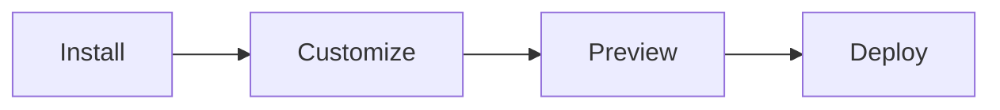

# Introduction

Sticky Add-to-Cart keeps your add-to-cart button visible at the bottom of product pages, making it easier for customers to purchase without scrolling.

## What It Does

A fixed cart bar stays accessible as customers browse product details, images, and reviews. No more scrolling back to find the buy button.

## Key Features

- ✅ **Always Visible** - Fixed at bottom, never scrolls away
- 🎨 **Variant Selection** - Choose size/color without scrolling up
- 📱 **Mobile Optimized** - Perfect responsive design
- 🎯 **Buy Now Button** - Express checkout for impulse buys
- 🌍 **Multi-Language** - Full translation support
- 💅 **Fully Customizable** - Match your brand perfectly

## How It Works

1. **Install** from Shopify App Store
2. **Customize** with visual editor
3. **Preview** in real-time
4. **Deploy** with one click

## Perfect For

| Store Type | Why It Helps |
|------------|--------------|
| **Fashion & Apparel** | Multiple variants (size, color) |
| **High-Traffic** | Long product descriptions |
| **Mobile-First** | Improve mobile UX |
| **Any Store** | Reduce purchase friction |

## Quick Stats

:::info Conversion Impact
Stores using sticky add-to-cart typically see:
- 📈 **15-30%** increase in add-to-cart rate
- ⚡ **Faster** purchase decisions
- 📱 **Better** mobile experience
:::

## Getting Started

Ready to boost conversions?

  <a className="button button--primary button--lg" href="./installation">
    Install Now →
  </a>
  <a className="button button--secondary button--lg" href="./quick-start">
    Quick Start
  </a>

